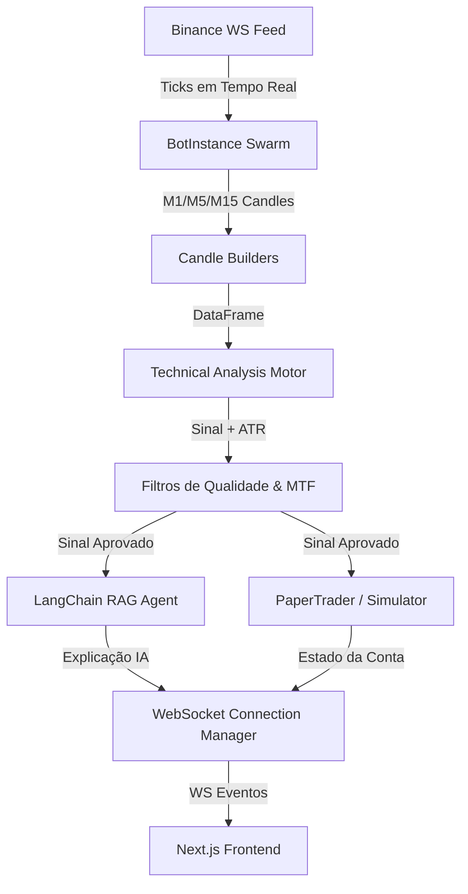

# 🧬 Auditoria de Arquitetura e Padrões de Projeto
## Mutant Crypto Bot — Relatório Técnico de Melhores Práticas

Este documento apresenta uma análise detalhada da arquitetura do **Mutant Crypto Bot**, contemplando a organização do backend, o sistema RAG (Geração Aumentada por Recuperação), o fluxo de dados em tempo real, melhores práticas e recomendações de design system para futuras evoluções.

---

## 1. Visão Geral da Arquitetura Atual

O ecossistema é dividido de forma limpa em duas frentes:
1.  **Frontend (Next.js):** Interface interativa que se conecta a um canal WebSocket persistente, exibindo gráficos em tempo real, catálogo de performance, e painel de decisões pré-trade.
2.  **Backend (FastAPI + Asyncio):** Motor assíncrono que orquestra conexões com a Binance API, gerencia o ciclo de vida de velas (M1, M5, M15) via Swarm (bots paralelos por ativo) e processa análises técnicas de forma matemática determinística.

---

## 2. Análise do Módulo RAG (Geração Aumentada por Recuperação)
O RAG está estruturado em `app/rag/agent.py` e `app/rag/vector.py`.

### Arquitetura Atual do RAG:
*   **Banco Vetorial:** Utiliza o **Chroma DB** persistido localmente (`chroma_db/`).
*   **Embeddings:** Rodado localmente através da biblioteca HuggingFace (`sentence-transformers/all-MiniLM-L6-v2`). Esta é uma excelente prática, pois elimina o custo de API para geração de embeddings e garante latência estável.
*   **Orquestração:** LangChain unindo prompts estruturados, Pydantic, e a API Manifest/OpenAI para geração de texto.

### 💡 Recomendações e Próximos Passos (Melhores Práticas):
1.  **Tratamento de Erros e Fallback no Vector Store:**
    Se o diretório `chroma_db` estiver ausente ou corrompido, o RAG atual falha silenciosamente ou quebra o WebSocket. Recomenda-se adicionar uma verificação automática no boot: se o banco não existir, disparar a função `build_vector_store()` de forma automatizada.
2.  **RAG Assíncrono:**
    O método `explain_signal` em `agent.py` é síncrono. Na chamada dentro do loop assíncrono do bot, usamos `asyncio.to_thread`. Para maximizar a vazão de concorrência com múltiplos ativos operando em paralelo, o ideal é converter a cadeia do LangChain para utilizar chamadas assíncronas nativas (`ainvoke`).

---

## 3. Fluxo de Dados e Test Harness (Ambiente de Testes)

O sistema de testes é composto por scripts como o `deep_backtest.py`, que valida estatisticamente as hipóteses no passado.

### 💡 Recomendações para o Harness de Testes:
1.  **Mocking e Injeção de Dependências:**
    Atualmente, os testes reais e simulações compartilham funções estritas de indicadores. Para testar novos regimes sem quebrar a lógica de produção, seria benéfico encapsular as estratégias sob uma interface/classe abstrata comum (`BaseStrategy`).
2.  **Sandbox Unitário:**
    A criação de testes unitários automatizados para a matemática das estratégias (ex: verificar se `eval_ema_macd` retorna CALL/PUT corretamente a partir de uma planilha estática de teste) evitaria qualquer regressão acidental de código ao modificar indicadores.

---

## 4. Próxima Geração do Design System (Frontend)

O frontend atual apresenta uma estética de "Cockpit de Decisão" baseada em **Glassmorphism** e cores de alto contraste, com excelente usabilidade. Para elevá-lo ao patamar de plataformas de trading profissionais (ex: TradingView/Bloomberg Terminal):

### Estética e Interação:
*   **Micro-interações de Execução:** Animações sutis de pulso e transição de cores (Fade) nos cards CALL/PUT quando a "Próxima Entrada Estimada" recalcula o preço dinamicamente a cada tick.
*   **Visualização de Alvos no Gráfico:** Desenhar linhas horizontais dinâmicas diretamente no gráfico da `lightweight-charts` correspondentes ao Stop Loss (vermelha pontilhada) e Take Profit (verde pontilhada) projetados no card de estimativa. Isso daria um feedback visual instantâneo do espaço que o preço tem para respirar.
*   **Tema Unificado com CSS Variables:** Manter todos os tokens de cores centralizados no CSS global (ex: `--success: #00c878`, `--danger: #ff4d4d`, `--background: #0d0e12`), facilitando a customização e garantindo harmonia visual rigorosa.
